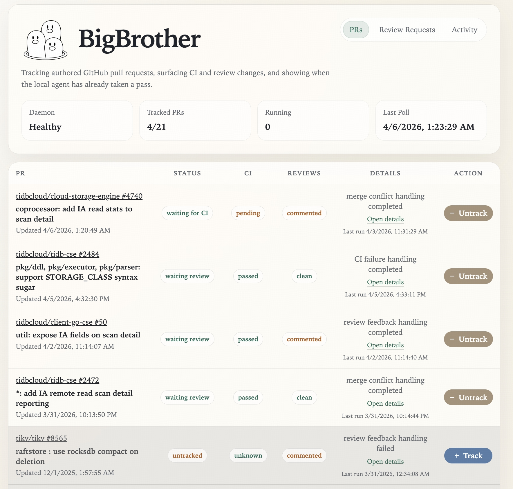
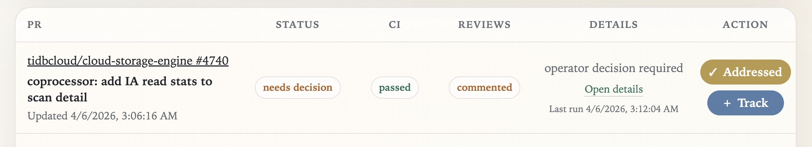
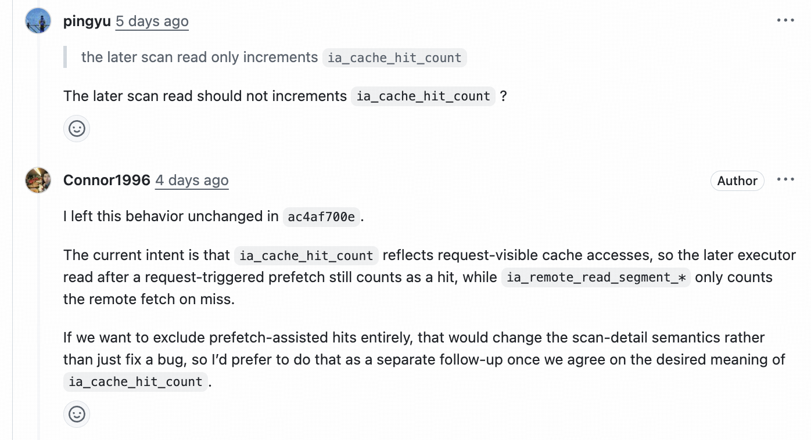
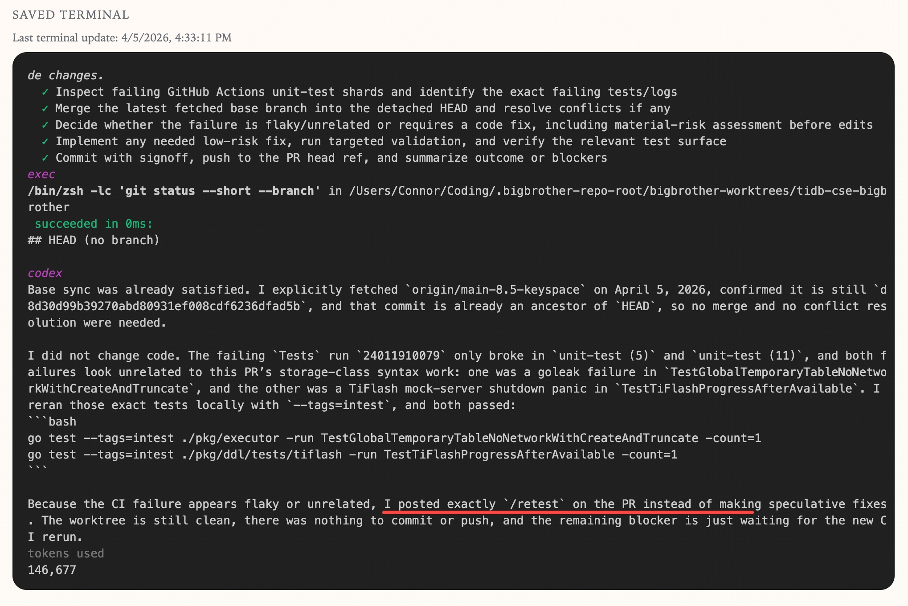
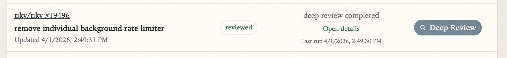

# BigBrother：一个帮你盯 GitHub PR 的本地 Agent
# BigBrother: a local agent for keeping an eye on your GitHub PRs

## 中文

在 Harness engineering 的当下，从需求到实现、测试、部署，端到端自动化已经完全可行。但在 TiDB/TiKV 的实际生产开发中发现，有些事情不是一轮就能做对的，我们还是需要和 agent 来回讨论设计以及在 Review 阶段反复修改实现，才能把东西打磨到足够好。

在实现阶段大家已经有很多和 agent 协作的方式可选：可以直接用 Codex、Claude Code 这样的 coding agent，可以拉起 subagents 去并行做研究、评审和实现，也可以用 slock.ai 这类 agent teams 形态去组织多人类、多 agent 的协作。种类繁多，各有各适合的实践。也正因为这样，BigBrother 并不是想把实现阶段这段开放式、探索式的工作流统一收口。

它想解决的是另一类问题：PR 提出之后，通常还需要反复处理 review comment、修复 CI 等后续事项。这个流程虽然周期较长，但路径相对明确。对 coding agent 来说，难点往往不在于执行这些动作本身，而在于长期挂起并持续追踪这些长尾问题。OpenClaw 的 cron job 确实可以承担追踪工作，但有时 review 过程中仍然需要人工介入做决策；而这类协作既要求交互足够灵活，也更适合放在一个持续可见的操作界面中承载，而不是仅仅依赖单一的 chat 用户界面。

## 它能做什么




BigBrother 以一个本地 daemon + web dashboard 的形态常驻运行。它会持续轮询你 github 上的 open PR，以及当前 request 你 review 的 PR；一旦发现有需要处理的信号，就使用自己的 managed worktree，把当前触发原因和 PR 上下文交给本地 codex/claude-code cli 来执行。整个 run 的 terminal 输出、结果和最后状态都会记录到 dashboard 里；如果配了飞书，关键信息也会通过飞书 cli 的 bot 来通知。

具体到日常场景，它的行为大致是这样的：

- `Review feedback`：当你 authored 的 PR 出现新的 review、inline comment 或普通 comment，而且这些反馈还没被处理过时，BigBrother 会把它当成一个新的 actionable signal。它会拉起一次 agent run 去读反馈、合并最新 base、尝试改动并 push，并回复 comment；如果 agent 认为这不是该自动拍板的改动，就会把 PR 升成 `needs decision`。当你介入完成后点击`Addressed` 再继续跟进。


- `CI failure`：当新的 failing check 或 status 出现时，BigBrother 会把它当成另一类触发信号。它可以让 agent 直接修代码，也可以在判断更像 flaky 或不值得 speculative fix 时选择发 `/retest`，而不是硬改代码。

- `Merge conflict`：当 PR 跟最新 base branch 冲突时，BigBrother 会在自己的 managed worktree 里让 agent 先做合并和冲突解决，而不是碰你的日常工作区。如果同一个冲突状态后面再次重试，它还可以从同一个 worktree 继续接着处理。
- `Review Requests`：对当前 request 你 review 的 PR，BigBrother 不会直接帮你改代码；它会把它们放进 `Review Requests` inbox，并允许你手动触发只读的 `Deep Review`。
它会生成结构化 review 结果，并在成功后只把最终整理好的 review artifact comment 回 PR。

- `Track / Untrack`：如果你暂时不想继续跟某个 PR，可以先 `Untrack`。这样它会把当前状态留在 dashboard 上，但先停止自动跟进和自动 run；等你准备好了，再 `Track` 回来，它就会重新进入正常轮询和处理流程。

## QuickStart

前置要求：

- Rust toolchain 和 `git`
- 已经安装并登录 `gh`
- 已经安装并登录 `codex` 或者 `claude`
- 如果你想接飞书通知，可选安装并登录 `lark-cli`

1. 复制配置模板

```bash
cp bigbrother.example.toml bigbrother.toml
```

2. 打开 `bigbrother.toml`，确认这两项：

- `workspace.root` 你想让 BigBrother 管理的仓库已经在本地，默认放在 `workspace.root` 下能被发现
- `<workspace.root>/<repo-name>` 找不到仓库时，才加 `workspace.repo_map`

3. 如果你需要飞书通知，安装并登录 `lark-cli`，再补 `notifications.feishu`；将 `receive_id` 设为你的飞书绑定邮箱。如果沿用模板里的 `"$FEISHU_NOTIFY_EMAIL"`，就把环境变量 `FEISHU_NOTIFY_EMAIL` 设成对应邮箱。

4. 启动：

```bash
cargo build --release
GITHUB_TOKEN="$(gh auth token)" target/release/bigbrother --config bigbrother.toml
```

5. 打开 [http://127.0.0.1:8787/](http://127.0.0.1:8787/)。

---

## English

In what people now call vibe coding, it is already becoming realistic to automate the whole path from requirement to implementation to testing to deployment. And during implementation, developers already have many ways to work with agents: coding agents such as Codex and Claude Code, subagent patterns for parallel research, review, and implementation, and agent-team setups such as slock.ai.

But in real production-grade software work, that workflow is still much harder to automate end to end. In practice, many tasks still need repeated back-and-forth with an agent, multiple design discussions, and several implementation passes before the result is actually good enough. That is exactly why BigBrother is not trying to standardize the open-ended, exploratory implementation phase.

It is built for a different part of the problem: the long tail that starts after a PR is already open. At that point, the expensive part is often not the code change itself. It is the repeated checking around review state, CI, mergeability, comments, failed runs, and which PR actually needs attention next. That problem is better served by a persistent operational surface than by a chat thread, which is also why it is not really the part of the workflow that an OpenClaw-style interface handles best.

## What it does

BigBrother runs as a local daemon plus web dashboard. It keeps polling the open PRs you authored as well as the PRs that currently request your review; when it sees a signal that needs action, it first resolves the local source repository, then creates or reuses its own managed worktree under `<workspace.root>/bigbrother-worktrees/<repo-name>-bigbrother`, syncs the latest PR head and base branch into that detached-HEAD workspace, and only then hands the current trigger plus PR context to the agent. The terminal output, run result, and latest status all flow back into the dashboard, and if Feishu is configured, the important completions, failures, and escalations can be pushed there too.

In day-to-day use, its behavior is roughly this:

- `Review feedback`: when an authored PR gets a new review, inline comment, or top-level comment that has not been handled yet, BigBrother treats that as a new actionable signal. It starts an agent run to read the feedback, merge the latest base, attempt the change, and push if it can; if the agent decides the change is not something it should land on its own, the PR moves to `needs decision`.
- `CI failure`: when a new failing check or status appears, BigBrother treats that as a separate trigger. It can ask the agent to fix code directly, but it can also choose to post `/retest` when the failure looks flaky or not worth a speculative code change.
- `Merge conflict`: when the PR no longer merges cleanly with the latest base branch, BigBrother asks the agent to merge and resolve conflicts inside its managed worktree instead of touching your everyday checkout. If you retry the same unresolved conflict later, it can resume from that same workspace.
- `Review requests`: for PRs that currently request your review, BigBrother does not try to edit code on your behalf. Instead, it keeps them in the `Review Requests` inbox and lets you manually trigger a read-only `Deep Review`.
- `Deep Review`: Deep Review is a read-only review pass. It produces a structured review result and, on success, posts only the final cleaned-up review artifact back to the PR instead of dumping raw terminal output into a comment.
- `Failed` and `needs decision`: if a run fails, the PR moves to `failed`, and scheduled polls do not keep retrying forever; it waits for you to click `Retry`. If the agent explicitly decides the change is non-trivial, the PR moves to `needs decision`, automatic handling freezes, and the dashboard waits for you to make the call or mark it `Addressed`.

The statuses you see in practice, such as `waiting review`, `waiting merge`, `conflict`, `failed`, `needs decision`, and `running`, are basically BigBrother flattening all of those long-tail PR situations into one persistent operational surface.

## Suggested screenshot slots

### Screenshot 1: home dashboard

This is the best place for a homepage screenshot that includes:

- the authored PR list
- the `Review Requests` and `Activity` tabs
- a few PRs in different states, such as `waiting review`, `failed`, and `needs decision`

This screenshot should support the core idea that BigBrother turns “which PR actually needs me right now?” into something you can scan at a glance.

> Screenshot placeholder: Home dashboard with PR list, Review Requests, Activity tabs, and mixed PR states.

### Screenshot 2: PR details with terminal output

This is the place for a detail-page screenshot that shows:

- terminal output
- the latest run result
- a concrete view of what the agent actually did, where it stopped, and why

This screenshot supports the idea that BigBrother is not only a status board; it also lets you inspect execution details when you need them.

> Screenshot placeholder: PR details page with saved or live terminal output.

### Screenshot 3: agent deciding to `/retest`

This is the best place for a screenshot that shows BigBrother is not blindly editing code. Ideally it captures:

- a failed CI run
- the agent deciding that the failure looks flaky or not worth changing code for directly
- an automatic `/retest` comment posted back to the PR

This screenshot supports the idea that BigBrother first chooses the right action, instead of assuming every problem should become a code change.

> Screenshot placeholder: PR timeline or comment thread showing automatic `/retest` after agent inspection.

### Screenshot 4: Deep Review and automatic comment reply

This is the best place for a review-request PR screenshot that shows:

- how `Deep Review` is triggered
- that the final review result is posted back as a PR comment
- that the comment is a cleaned-up review artifact rather than raw terminal noise

This screenshot supports the idea that BigBrother is useful not only for authored PRs, but also for PRs where you are the reviewer.

> Screenshot placeholder: Deep Review flow with resulting PR comment posted automatically.

## How to get started

Prerequisites:

- a working Rust toolchain and `git`
- `gh` is installed and already authenticated
- a working `codex` command on the machine
- Git credentials that can push back to your PR branches
- local checkouts of the repositories you want BigBrother to manage, discoverable from `workspace.root`
- optional `lark-cli` installation and login if you want Feishu notifications

Manual setup is straightforward:

1. Copy the config template.

```bash
cp bigbrother.example.toml bigbrother.toml
```

2. Open `bigbrother.toml` and confirm the important settings:

- confirm `workspace.root`
- add `workspace.repo_map` only for repositories that are not located at `<workspace.root>/<repo-name>`
- keep `command = "codex"` unless your machine clearly uses another agent command
- if the template still contains `author = "$GITHUB_USER"`, replace it with your real GitHub login or remove the field entirely
- leave `dangerously_bypass_approvals_and_sandbox` off unless you explicitly want unsandboxed local access on this host

3. If you want Feishu notifications, optionally install and log into `lark-cli`, then fill in `notifications.feishu`. Set `receive_id` to the email address bound to your Feishu account. If you keep the template value `"$FEISHU_NOTIFY_EMAIL"`, set the `FEISHU_NOTIFY_EMAIL` environment variable to that email address.

4. Build and start the daemon.

```bash
cargo build --release
GITHUB_TOKEN="$(gh auth token)" target/release/bigbrother --config bigbrother.toml
```

If you already manage `GITHUB_TOKEN` or `GH_TOKEN` yourself, you can keep using that existing environment variable setup.

5. Open [http://127.0.0.1:8787/](http://127.0.0.1:8787/).

If your repositories already live under `~/Coding`, putting `bigbrother` next to them is usually the simplest layout. Otherwise, set `workspace.root` to an absolute path such as `/Users/alice/Coding`. The current config loader does not expand `~` or `$HOME/Coding`.
